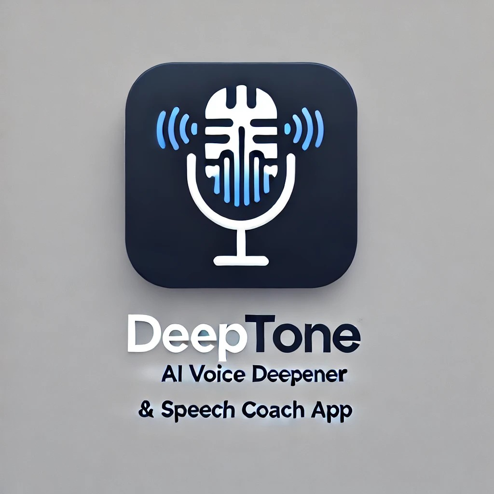
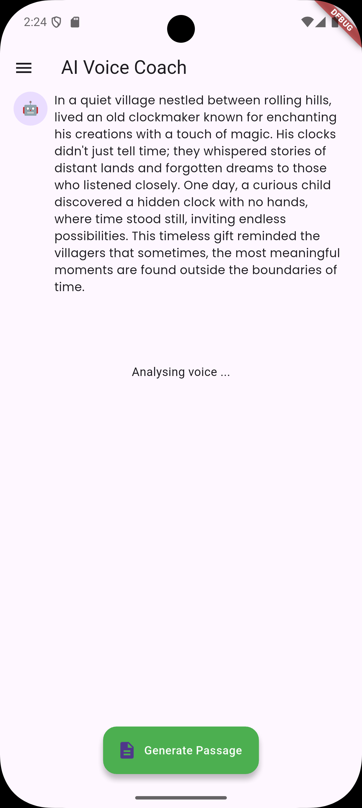
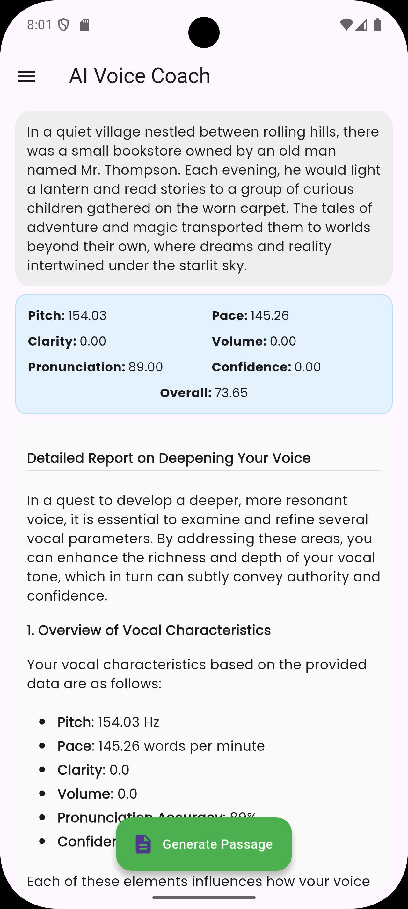

# **DeepTone** 🎙️  

<p align="center">
  
</p>

**DeepTone** is an AI-powered voice analysis and coaching tool designed to help users develop a deeper, more authoritative voice. By analyzing key vocal parameters such as **pitch, pace, clarity, volume, pronunciation accuracy, and confidence**, the app provides statically measured speech metrics, insightful feedback, and practical exercises to enhance vocal resonance and control.  

## **Features** 🚀  

- 🎤 **Real-time Voice Analysis** – Get instant feedback on how your voice is perceived.  
- 🔍 **Detailed Insights** – Understand how pitch, pace, and articulation shape your vocal tone.  
- 📊 **Personalized Recommendations** – Receive tailored exercises to improve vocal depth and presence.  
- 🏋️ **Training Modules** – Practice breathing techniques, resonance exercises, and articulation drills.  
- 📈 **Progress Tracking** – Monitor improvements over time and refine your speaking style.  

## **How It Works** 🛠️  

1. Record or input an audio sample.  
2. The system extracts vocal parameters and evaluates voice characteristics using Dolby's API and Deepgram API.  
3. AI generates a **comprehensive analysis** through ChatGPT and suggests targeted improvements.  
4. Follow guided exercises to **train your voice for a deeper, richer tone**.  

## **App Screenshots** 📱

<p align="center">
  
  &nbsp;&nbsp;&nbsp;&nbsp;
  
</p>

## **Why Use DeepTone?** 🤔  

✅ **Improve Vocal Confidence** – Speak with clarity and authority in any situation.  
✅ **Enhance Communication Skills** – Make a lasting impression in presentations, meetings, or social settings.  
✅ **Backed by AI & Speech Science** – Combines real-time analysis with proven vocal techniques.  

---

# DeepTone - AI Voice Coach
## Technology Stack

- Flutter for cross-platform mobile development
- Dolby API for advanced audio processing and enhancement
- Deepgram API for accurate speech-to-text and voice analysis
- OpenAI's ChatGPT as the AI agent for generating comprehensive reports and feedback
- FFT (Fast Fourier Transform) algorithms for audio processing
- Cloud-based AI services for advanced vocal analysis

## Getting Started

### Prerequisites

- Flutter SDK (version 3.0+)
- Android Studio or Xcode
- A physical device for testing (recommended for audio features)

### Installation

1. Clone the repository
   ```
   git clone https://github.com/yourusername/deeptone.git
   ```
2. Navigate to the project directory
   ```
   cd deeptone
   ```
3. Install dependencies
   ```
   flutter pub get
   ```
4. Run the app
   ```
   flutter run
   ```

## Usage

1. Grant microphone permissions when prompted
2. Select a training exercise or free practice mode
3. Follow the on-screen instructions
4. Receive instant feedback on your vocal performance with precise measurements of pitch, resonance, and other key metrics
5. Review your AI-generated comprehensive report with specific recommendations to deepen your voice
6. Track your progress over time with before/after comparisons

## Contributing

Contributions are welcome! Please feel free to submit a Pull Request.

## License

This project is licensed under the MIT License - see the LICENSE file for details.

## Acknowledgments

- Voice analysis algorithms adapted from [relevant source]
- Special thanks to voice coaches who provided expert input
